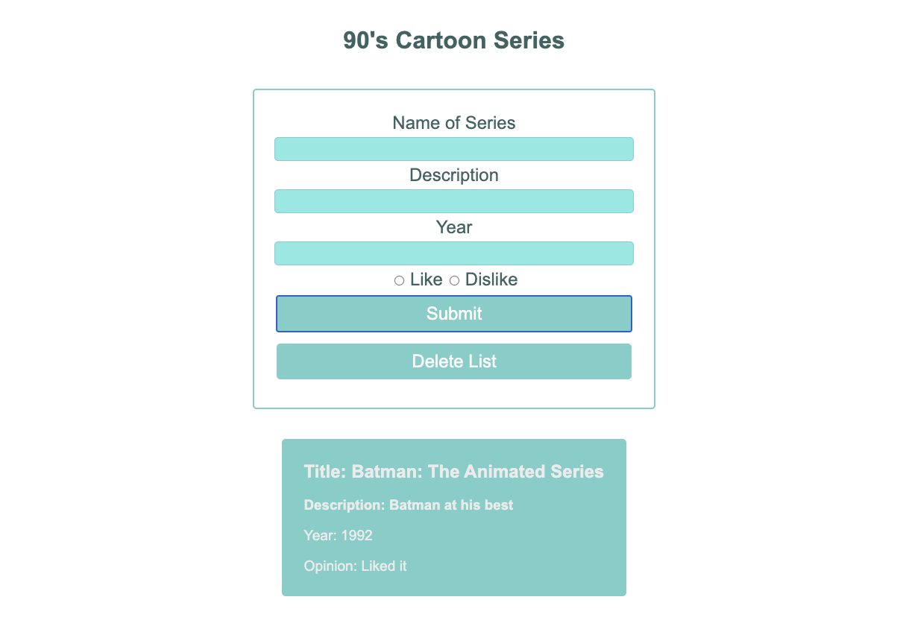

# JavaScript DOM Manipulation - 90's Cartoon List
This one page app demonstrates the following:
* The ability to attach event listeners to DOM elements to respond to events
* The ability to access data from the event object
* The ability to use the document object to add information to the page by manipulating the DOM

The theme I chose for this app was 90's cartoons. The app carries out the following:
* Contains a form in HTML with inputs for required data
* When the form is submitted, data is accessed from the form in the form’s submit event object
* Creates a list in HTML
* Appends the submitted data to the list
* Contains a “Delete All” <button> which clears all of the list items from the list

## Run App
To run the app open the index.html file in a web browser.

